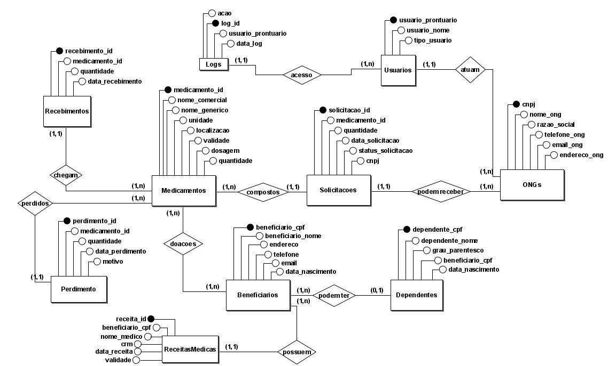
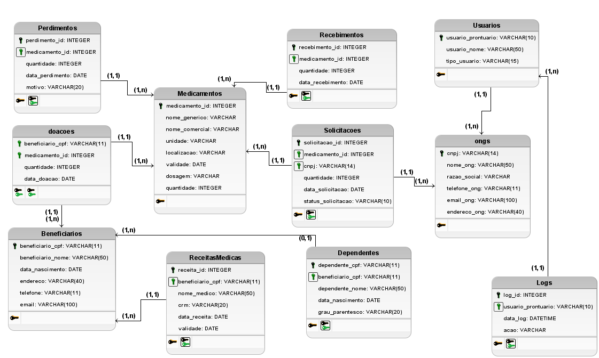

# 🏠 Pharmalog - Sistema de Gestão de Medicamentos

## 📑 Descrição Geral
Este é um projeto desenvolvido no contexto da disciplina **Banco de Dados 1**.


O **Pharmalog** é um sistema desenvolvido para gerenciar medicamentos em uma rede de distribuição, envolvendo entidades como beneficiários, dependentes, ONGs, usuários, receitas médicas, solicitações de medicamentos, perdas, recebimentos e logs de atividades. O objetivo principal é garantir um controle eficiente e transparente da cadeia de distribuição de medicamentos, desde o recebimento até a entrega aos beneficiários.

Este repositório contém todos os arquivos necessários para a compreensão e implementação do sistema Pharmalog.
O modelo de dados foi criado em três fases:
- Modelo Conceitual: Diagrama Entidade-Relacionamento (ER).
- Modelo Lógico: Estrutura de tabelas e suas relações.
- Modelo Físico: Criação das tabelas no banco de dados.
## 🌟 Modelo Conceitual
O modelo conceitual foi projetado para representar as entidades principais e seus relacionamentos no contexto do sistema. As principais entidades incluem:

- **Beneficiários**: Indivíduos que recebem medicamentos.
- **Dependentes**: Pessoas vinculadas aos beneficiários.
- **ONGs**: Organizações não governamentais que atuam na distribuição de medicamentos.
- **Usuários**: Pessoas responsáveis pelo gerenciamento do sistema.
- **Medicamentos**: Produtos farmacêuticos disponíveis no sistema.
- **Recebimentos**: Registro de entrada de medicamentos no estoque.
- **Perdimentos**: Registro de perdas de medicamentos.
- **Solicitações**: Pedidos de medicamentos feitos por ONGs ou beneficiários.
- **Receitas Médicas**: Documentos que autorizam a dispensação de medicamentos.
- **Logs**: Registros de todas as atividades realizadas no sistema.

## 🛠️ Modelo Lógico
O modelo lógico detalha as tabelas e suas colunas, bem como as chaves primárias e estrangeiras que definem as relações entre as tabelas. As principais tabelas incluem:

- **Beneficiários** (CPF, nome, data de nascimento, endereço, telefone, e-mail)
- **Dependentes** (CPF, nome, grau de parentesco, CPF do beneficiário)
- **ONGs** (CNPJ, nome, razão social, telefone, e-mail, endereço)
- **Usuários** (Prontuário, nome, tipo de usuário)
- **Medicamentos** (ID, nome genérico, nome comercial, unidade, localização, validade, dosagem, quantidade)
- **Recebimentos** (ID, medicamento, quantidade, data de recebimento)
- **Perdimentos** (ID, medicamento, quantidade, data de perda, motivo)
- **Solicitações** (ID, medicamento, quantidade, data, status, ONG/beneficiário)
- **Receitas Médicas** (ID, beneficiário, nome do médico, CRM, data de emissão, validade)
- **Logs** (ID, usuário, data e hora, ação realizada)

## 🛠 Tecnologias Utilizadas
- **Banco de Dados**: SQLite
- **Modelagem**: BRModelo (para os diagramas Conceitual e Lógico)
- **Linguagem SQL**: Utilizada para a criação e manipulação do banco de dados

## 🌐 Diagrama ER
Os diagramas conceitual e lógico foram criados utilizando o **BRModelo** e podem ser encontrados nos arquivos anexados ao repositório:

- **Diagrama Conceitual**: 


    

- **Diagrama Lógico**:



## 🚀 Como Executar
### 1️⃣ Clonar o Repositório
```
git clone https://github.com/cavalcantecpaulo/pharmalog.git
```

### 2️⃣ Configurar o Banco de Dados no SQLite Online

- Acesse o SQLite Online.

- Clique no ícone + "Add Database/Import" para adicionar o banco de dados.

- Após isso clique em open SQLiteDB e selecione o arquivo DB para visualizar o banco de dados.

### 3️⃣ Banco de Dados Abastecido
O banco de dados Pharmalog Testes já está abastecido com dados de teste para facilitar o uso do sistema. Não é necessário inserir dados manualmente. Caso queira verificar ou alterar esses dados, basta acessar o banco de dados e usar os dados já inseridos.

### 4️⃣ Executar a Aplicação
Se houver uma aplicação frontend/backend associada, siga as instruções do diretório correspondente. O SQLite Online apenas gerencia o banco de dados; Para rodar o frontend/backend, você precisa configurar isso à parte no seu ambiente de desenvolvimento.

## 👨‍💻 Sobre o Autor

Este projeto foi desenvolvido por mim como projeto final do curso de **Banco de Dados 1**. O objetivo foi criar um sistema eficiente para o gerenciamento de medicamentos em ONGs.

## 📞 Contato

Se você tiver dúvidas ou sugestões sobre o projeto, entre em contato comigo:

- **E-mail**: pauloc1807@hotmail.com
- **LinkedIn**: [Paulo Cavalcante Caroba](https://www.linkedin.com/in/paulocavalcantec/)

## 📝 Licença

Este projeto está licenciado sob a **MIT License** - veja o arquivo [LICENSE](./LICENSE) para mais detalhes.
